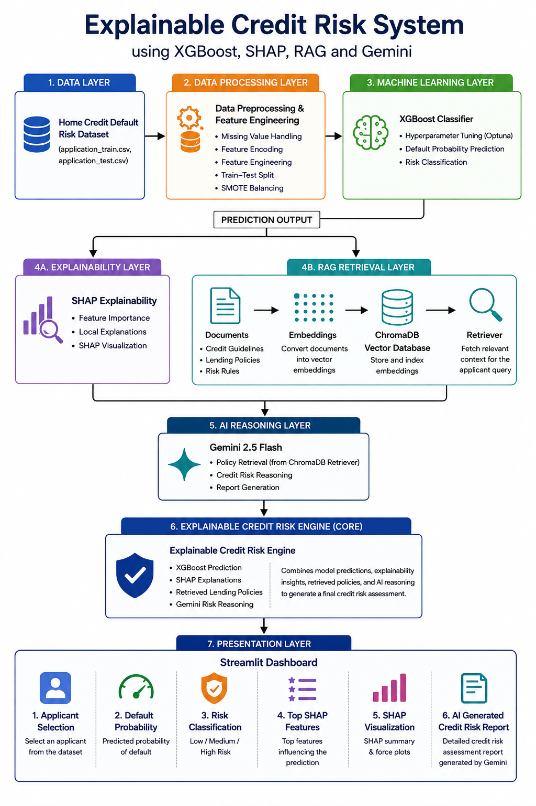

# 📊 Explainable Credit Risk System

An AI-powered credit risk assessment platform that combines **XGBoost**, **SHAP Explainability**, **Retrieval-Augmented Generation (RAG)**, and **Google Gemini** to provide transparent, explainable, and policy-aware lending decisions.

The system predicts the probability of loan default, explains the factors influencing the prediction, retrieves relevant lending policies, and generates an AI-powered credit risk assessment report through an interactive Streamlit dashboard.

---

## 🚀 Features

### 🤖 Machine Learning
- Loan Default Prediction using XGBoost
- Hyperparameter Optimization using Optuna
- Risk Classification (Low, Medium, High)

### 🔍 Explainability
- SHAP Feature Importance
- Local Explanations for Individual Applicants
- SHAP Visualizations

### 📚 Retrieval-Augmented Generation (RAG)
- Lending Policy Retrieval
- Credit Guideline Retrieval
- Risk Rule Retrieval
- ChromaDB Vector Database

### 🧠 Generative AI
- Google Gemini Integration
- AI-Powered Credit Risk Reports
- Policy-Aware Risk Assessment

### 🌐 Dashboard
- Applicant Selection
- Default Probability Prediction
- Risk Classification
- SHAP Explanations
- SHAP Visualizations
- AI Generated Credit Risk Reports

---

## 🏗️ System Architecture



---

## 🛠️ Tech Stack

| Category | Technologies |
|-----------|-------------|
| Programming Language | Python |
| Data Processing | Pandas, NumPy |
| Machine Learning | Scikit-Learn, XGBoost |
| Hyperparameter Optimization | Optuna |
| Explainability | SHAP |
| RAG Framework | LangChain |
| Vector Database | ChromaDB |
| Large Language Model | Gemini 2.5 Flash |
| Dashboard | Streamlit |
| Model Storage | Joblib |
| Version Control | Git & GitHub |

---

## 📂 Dataset

This project uses the **Home Credit Default Risk Dataset** from Kaggle.

Dataset Link:

https://www.kaggle.com/competitions/home-credit-default-risk

The dataset contains applicant financial and demographic information used to predict the likelihood of loan default.

---

## 🔄 System Workflow

```text
Home Credit Dataset
        ↓
Data Preprocessing & Feature Engineering
        ↓
XGBoost Model
        ↓
Default Probability Prediction
        ↓
        ├── SHAP Explainability
        │
        └── RAG Policy Retrieval
                ↓
            ChromaDB
                ↓
            Gemini
                ↓
Credit Risk Assessment Report
                ↓
Streamlit Dashboard
```

---

## 🌐 Dashboard

The Streamlit dashboard provides an end-to-end credit risk assessment workflow.

### Dashboard Capabilities

- Select an applicant from the dataset
- Predict default probability
- Classify applicant risk level
- Display top SHAP features
- Visualize feature contributions
- Retrieve relevant lending policies
- Generate AI-powered credit risk reports

---

## 📸 Screenshots

### Low Risk Applicant

#### Dashboard


---

### Medium Risk Applicant

#### Dashboard


---

### Architecture Diagram

#### Diagram


---

## 📁 Project Structure

```text
Explainable-Credit-Risk-System/
│
├── dashboard/
│   └── app.py
│
├── data/
│   ├── raw/
│   └── processed/
│
├── models/
│
├── notebooks/
│
├── rag/
│   ├── documents/
│   └── vectordb/
│
├── reports/
│   ├── diagrams/
│   ├── screenshots/
│   └── report/
│
├── requirements.txt
│
└── README.md
```

---

## ⚙️ Installation

Clone the repository:

```bash
git clone https://github.com/AdithyaD247/Explainable-Credit-Risk-System.git

cd Explainable-Credit-Risk-System
```

Create a virtual environment:

```bash
python -m venv venv
```

Activate the environment:

### Windows

```bash
venv\Scripts\activate
```

Install dependencies:

```bash
pip install -r requirements.txt
```

---

## ▶️ Run the Dashboard

```bash
streamlit run dashboard/app.py
```

---

## 🔮 Future Enhancements

- Manual Applicant Data Entry
- PDF Credit Risk Report Export
- Cloud Deployment
- Real-Time Loan Scoring
- Advanced Fairness Monitoring
- Multi-Model Ensemble Learning

---

## 👨‍💻 Author

**Adithya D**

Project: **Explainable Credit Risk System using XGBoost, SHAP, RAG and Gemini**

GitHub: 
https://github.com/AdithyaD247/Explainable-Credit-Risk-System


---

⭐ If you found this project useful, consider giving the repository a star.