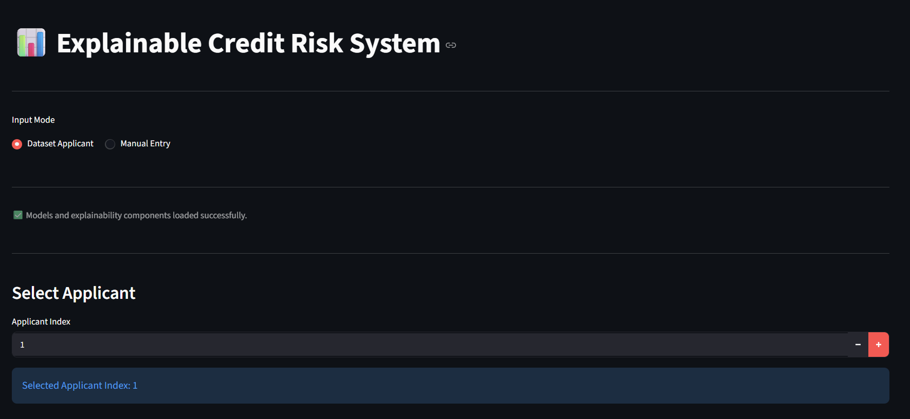
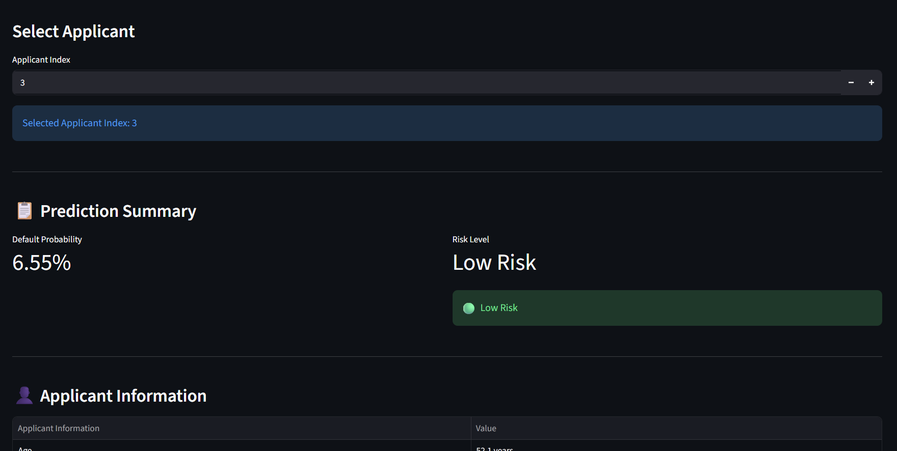
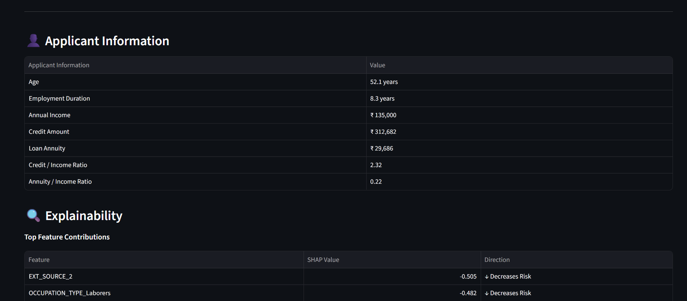
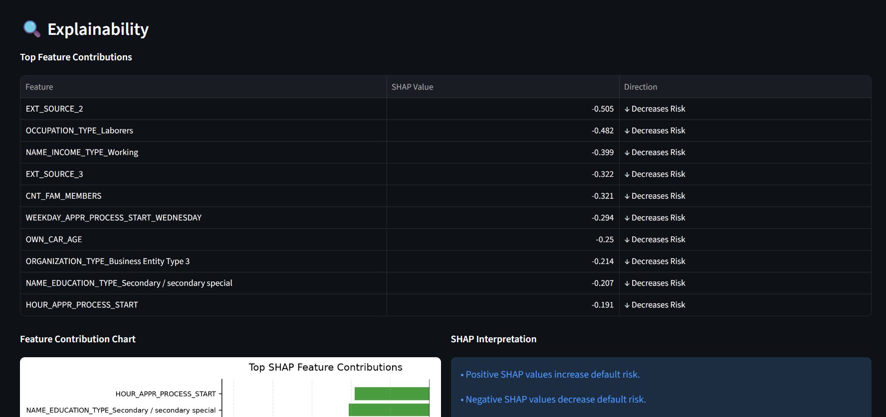
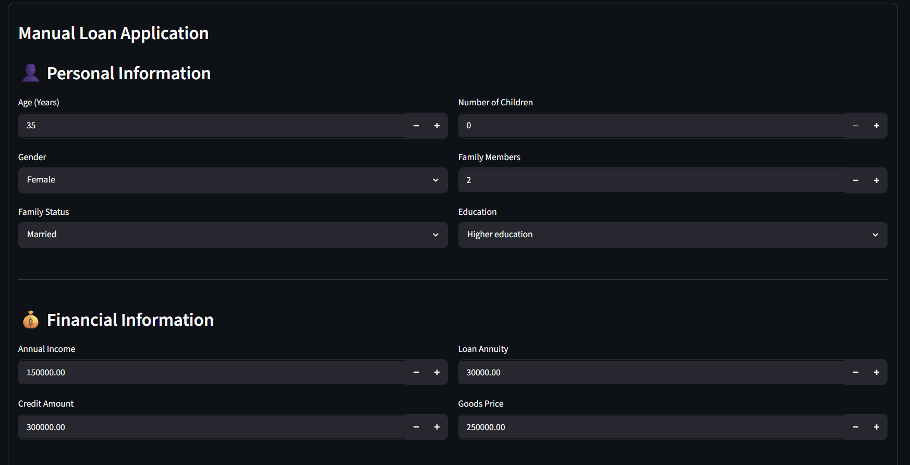
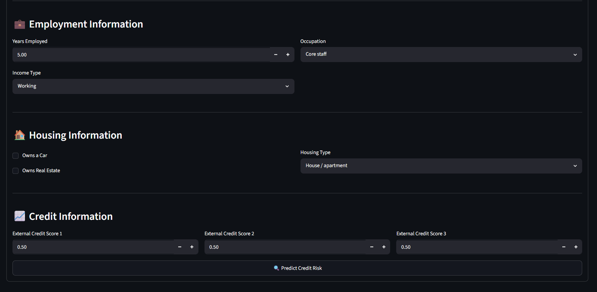
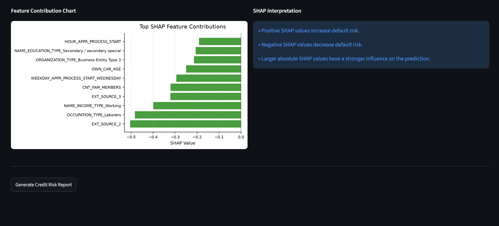
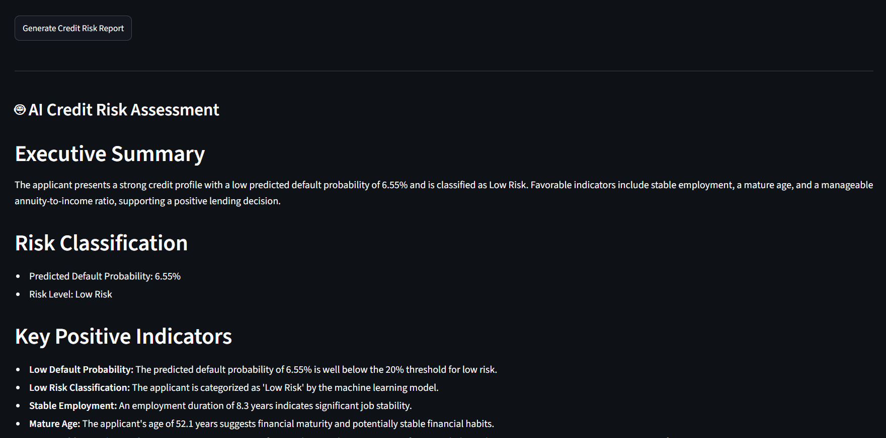
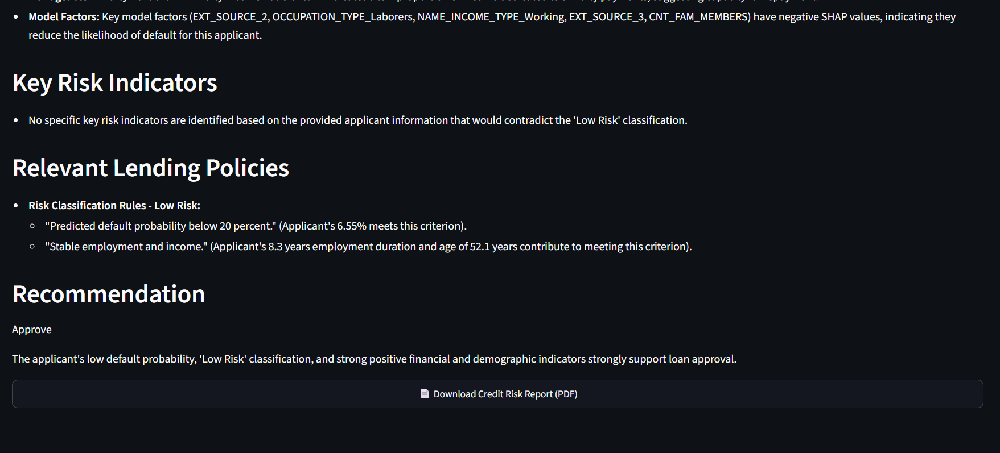
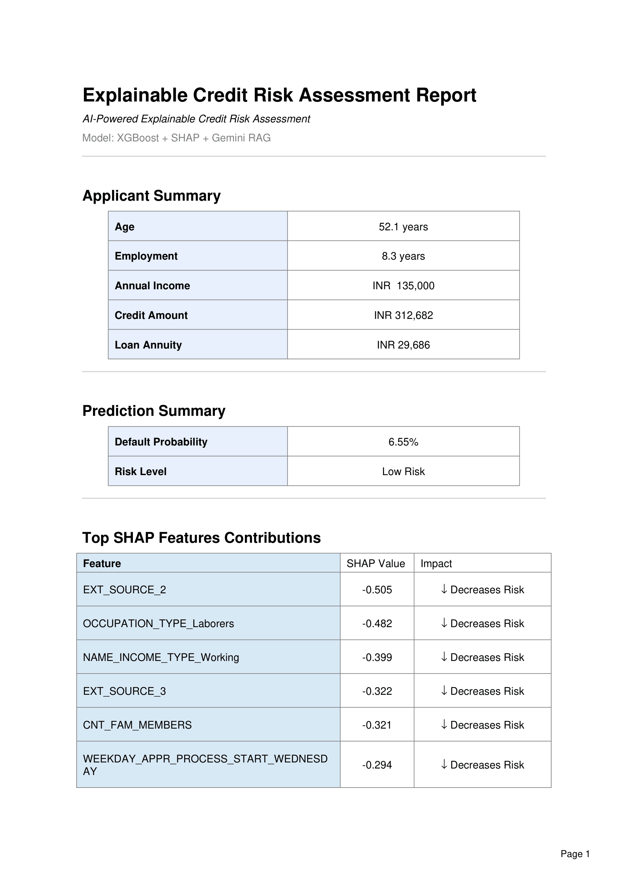

# 🏦 Explainable Credit Risk System


> **An AI-powered credit risk assessment system that predicts loan default probability, explains every prediction using SHAP, retrieves relevant lending policies using Retrieval-Augmented Generation (RAG), and generates professional PDF credit risk reports through an interactive Streamlit dashboard.**

<p align="center">



</p>


## 📖 Project Overview

Financial institutions rely on accurate credit risk assessment to determine whether an applicant is likely to repay a loan. Traditional machine learning models often provide high predictive performance but offer little transparency, making it difficult for loan officers to understand or justify automated decisions.

The **Explainable Credit Risk System** addresses this challenge by combining **Machine Learning**, **Explainable AI (SHAP)**, and **Retrieval-Augmented Generation (RAG)** into a single interactive application.

The system predicts an applicant's probability of loan default using an XGBoost model, explains the key factors influencing the prediction with SHAP, retrieves relevant lending policies from a ChromaDB knowledge base, and uses Google Gemini to generate a contextual AI-powered credit risk assessment. Users can evaluate applicants from the dataset or manually enter applicant information, and export the complete analysis as a professional PDF report.

## 🚀 Project Highlights

- ✅ End-to-End Credit Risk Prediction Pipeline
- ✅ Explainable AI using SHAP (Global & Local Explanations)
- ✅ XGBoost-based Default Probability Prediction
- ✅ Retrieval-Augmented Generation (RAG) using LangChain + ChromaDB
- ✅ AI-powered Credit Risk Assessment with Google Gemini 2.5 Flash
- ✅ Professional PDF Report Generation
- ✅ Interactive Streamlit Dashboard
- ✅ Support for Dataset Applicants and Manual Applicant Entry
- ✅ Modular, Scalable, and Production-Oriented Project Structure


## 🎯 Project Objectives

The primary objective of this project is to build an explainable AI-powered credit risk assessment system that goes beyond traditional machine learning predictions.

The system aims to:

- Predict the probability of loan default using XGBoost.
- Explain every prediction using SHAP Explainable AI.
- Retrieve relevant lending policies using Retrieval-Augmented Generation (RAG).
- Generate human-readable AI credit risk assessments using Google Gemini 2.5 Flash.
- Produce professional PDF reports for transparent decision-making.
- Provide an intuitive Streamlit dashboard for real-world usability.


## ✨ Key Features

### 🤖 Intelligent Credit Risk Prediction

* Predicts the probability of loan default using an optimized XGBoost model.
* Classifies applicants into **Low**, **Medium**, or **High Risk** categories.
* Supports both **dataset-based applicants** and **manual applicant evaluation**.

---

### 🔍 Explainable AI with SHAP

* Explains every prediction using SHAP values.
* Displays the most influential features affecting the prediction.
* Provides interactive feature contribution charts and detailed explanations.

---

### 📚 AI-Powered Credit Risk Assessment

* Uses **Retrieval-Augmented Generation (RAG)** to retrieve relevant lending policies.
* Combines retrieved policy context with applicant information.
* Generates contextual credit risk assessments using **Google Gemini**.

---

### 📄 Professional PDF Report Generation

* Exports a comprehensive credit risk report in PDF format.
* Includes applicant information, prediction summary, SHAP explanations, and AI-generated assessment.
* Designed for easy sharing and documentation.

---

### 🌐 Interactive Streamlit Dashboard

* Simple and intuitive interface for exploring applicants.
* Dedicated workflows for:

  * Dataset Applicant Analysis
  * Manual Applicant Evaluation
* Real-time prediction, explainability, and report generation.

---

### 🏗️ Modular Project Architecture

* Well-organized codebase with reusable utility modules.
* Separate components for prediction, SHAP, RAG, PDF generation, and UI.
* Designed for scalability and maintainability.


## 📸 Dashboard Preview

### 🏠 Home Dashboard

<p align="center">

</p>

---

### 👤 Dataset Applicant Analysis

<p align="center">

</p>

<p align="center">

</p>

<p align="center">

</p>

---

### 📝 Manual Applicant Evaluation

<p align="center">

</p>

<p align="center">

</p>

---

### 🔍 SHAP Explainability

<p align="center">

</p>

---

### 🤖 AI Credit Risk Assessment

<p align="center">

</p>

<p align="center">

</p>

---

### 📄 Generated PDF Report

<p align="center">

</p>


## 🏗️ System Architecture

The following diagram illustrates the end-to-end workflow of the Explainable Credit Risk System.

<p align="center">

</p>


## 🛠️ Tech Stack

| Category                       | Technologies                    |
| ------------------------------ | ------------------------------- |
| Programming Language           | Python                          |
| Dashboard                      | Streamlit                       |
| Machine Learning               | Scikit-learn, XGBoost, Optuna   |
| Explainability                 | SHAP                            |
| Data Processing                | Pandas, NumPy                   |
| Retrieval-Augmented Generation | LangChain                       |
| Vector Database                | ChromaDB                        |
| Large Language Model           | Google Gemini 2.5 Flash         |
| PDF Generation                 | ReportLab                       |
| Model Storage                  | Joblib                          |
| Environment Management         | Python Dotenv                   |
| Version Control                | Git & GitHub                    |


## 📂 Project Structure

```text
Explainable-Credit-Risk-System/
│
├── dashboard/
│   ├── app.py                  # Main Streamlit application
│   │
│   ├── pages/
│   │   ├── dataset_applicant.py
│   │   └── manual_entry.py
│   │
│   └── utils/
│       ├── feature_engineering.py
│       ├── model_utils.py
│       ├── pdf_utils.py  
│       ├── predict_utils.py
│       ├── rag_utils.py
│       ├── session_state.py
│       ├── shap_utils.py
│       └── ui_utils.py
│
├── data/   
│   ├── raw/
│   │    ├── application_test.csv
│   │    └── application_train.csv
│   │   
│   └── processed/   
│         ├── y_train_smote.pkl
│         ├── X_train_smote.pkl
│         ├── preprocessed_v1.csv
│         └── preprocessed_v2_encoded.csv
├── models/
│    ├── best_xgb_model.joblib
│    ├── manual_entry_features.joblib
│    └── manual_entry_xgb_model.joblib
│
├── notebooks/
│
├── rag/
│   ├── documents/
│   │    ├── credit_guidelines
│   │    ├── lending_policies
│   │    └── risk_rules
│   │   
│   └── vectordb/
│
├── reports/
│    └── screenshots
│
├── requirements.txt
├── LICENSE
├── .gitignore
└── README.md
```


## 📦 Repository Contents

This repository includes everything required to reproduce the project:

- 📂 Complete source code
- 🤖 Trained XGBoost models
- 📊 Interactive Streamlit dashboard
- 🔍 SHAP explainability pipeline
- 📚 RAG pipeline with LangChain and ChromaDB
- 🤖 Google Gemini integration
- 📄 Professional PDF report generator
- 🖼️ Dashboard screenshots
- 📖 Comprehensive project documentation


## ⚙️ Installation

### 1. Clone the Repository

```bash
git clone https://github.com/AdithyaD247/Explainable-Credit-Risk-System.git

cd Explainable-Credit-Risk-System
```

---

### 2. Create a Virtual Environment

```bash
python -m venv venv
```
Requirements

Python 3.11 or later

---

### 3. Activate the Environment

**Windows**

```bash
venv\Scripts\activate
```

**Linux / macOS**

```bash
source venv/bin/activate
```

---

### 4. Install Dependencies

```bash
pip install -r requirements.txt
```

---

### 5. Configure Environment Variables

Create a `.env` file in the project root and add your Google Gemini API key:

```text
GEMINI_API_KEY=your_api_key_here
```

## ▶️ Running the Application

Launch the Streamlit dashboard:

```bash
streamlit run dashboard/app.py
```

The application will be available at:

```text
http://localhost:8501
```

The application provides two analysis workflows:

* **Dataset Applicant Analysis** – Evaluate applicants from the Home Credit dataset.
* **Manual Applicant Evaluation** – Enter applicant information manually to generate a prediction and AI-powered assessment.


## 🧠 Machine Learning Pipeline

The machine learning pipeline follows a structured workflow for credit risk prediction:

1. Data preprocessing and missing value handling.
2. Feature engineering using applicant financial and demographic information.
3. Training a tuned XGBoost classifier using Optuna.
4. Predicting the probability of loan default.
5. Classifying applicants into **Low**, **Medium**, or **High Risk** categories.
6. Explaining model predictions using SHAP values.


## 🔍 Explainability with SHAP

Model predictions are accompanied by SHAP (SHapley Additive exPlanations) values to improve transparency.

For each prediction, the dashboard provides:

* Top contributing features.
* Feature contribution visualization.
* Positive and negative feature impacts.
* Human-readable interpretation of prediction factors.

This allows users to understand **why** the model predicted a particular level of credit risk instead of treating the model as a black box.


## 🤖 AI Credit Risk Assessment (RAG)

To provide more informative and context-aware recommendations, the system integrates a **Retrieval-Augmented Generation (RAG)** pipeline.

Instead of relying solely on the language model, the application first retrieves relevant lending policies, credit guidelines, and risk rules from a **ChromaDB** vector database. These retrieved documents are then provided as context to **Google Gemini**, enabling the model to generate applicant-specific credit risk assessments that are grounded in the organization's lending policies.

### RAG Workflow

```text
Prediction + SHAP Explanation
                │
                ▼
Retrieve Lending Policies
                │
                ▼
ChromaDB
                │
                ▼
Gemini 2.5 Flash
                │
                ▼
Explainable AI Assessment
```

---

## 📄 Professional PDF Report

The application can generate a comprehensive PDF report for every applicant.

Each report includes:

* Applicant information
* Default probability prediction
* Risk classification
* SHAP feature importance table
* SHAP impact explanation
* AI-generated credit risk assessment
* Relevant lending policy references

The generated report is designed to support transparent decision-making and can be shared with loan officers or stakeholders.

---


## 🚀 Future Improvements

Although the current system is fully functional, several enhancements can further improve its capabilities.

* Deploy the application to a cloud platform (Streamlit Community Cloud, Azure, or AWS).
* Develop REST APIs for integration with external systems.
* Add user authentication and role-based access.
* Add fairness and bias monitoring for responsible AI.
* Support batch prediction for multiple applicants.
* Monitor model performance and data drift over time.

---


## 📊 Dataset

This project uses the **Home Credit Default Risk** dataset provided by **Kaggle**.

The dataset contains demographic, financial, employment, and credit-related information for loan applicants and is used to predict the probability of loan default.

### Dataset Information

- **Source:** Home Credit Default Risk (Kaggle)
- **Training File:** `application_train.csv`
- **Testing File:** `application_test.csv`
- **Target Variable:** `TARGET`
  - `0` → Loan Repaid
  - `1` → Loan Default

### Kaggle Dataset

[Home Credit Default Risk Dataset](https://www.kaggle.com/competitions/home-credit-default-risk)

> **Note:** Due to Kaggle's licensing terms and the large dataset size, the dataset is **not included** in this repository. Please download it directly from Kaggle and place the files inside the `data/raw/` directory before running the project.

---

## 📜 License

This project is licensed under the **MIT License**.

See the [LICENSE](LICENSE) file for details.

---

## 👨‍💻 Author

**Adithya D**

If you'd like to discuss this project, collaborate, or provide feedback, feel free to connect.

* GitHub: https://github.com/AdithyaD247

---

## ⭐ Support

If you found this project useful or interesting, consider giving the repository a ⭐ on GitHub.

It helps others discover the project and motivates future improvements.
